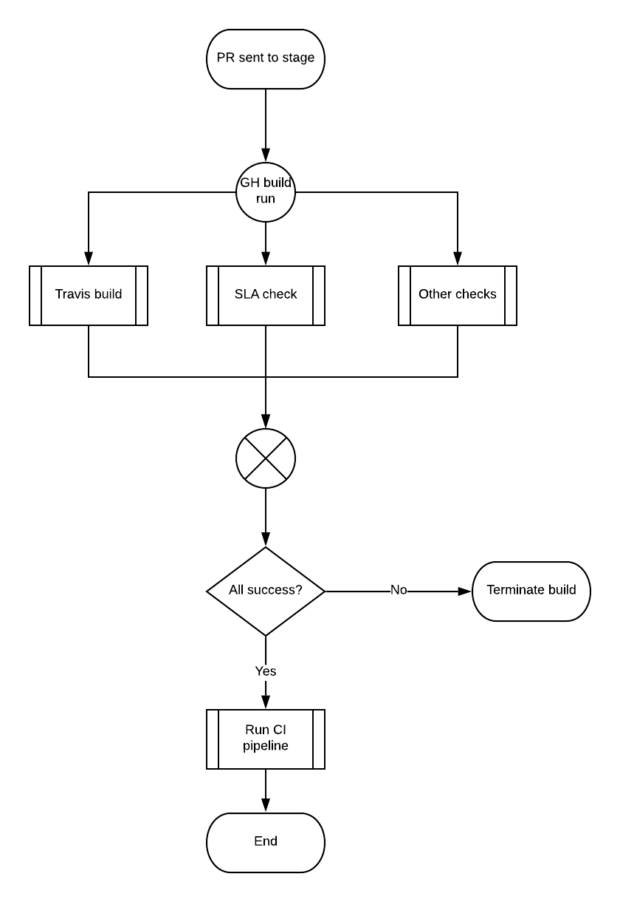
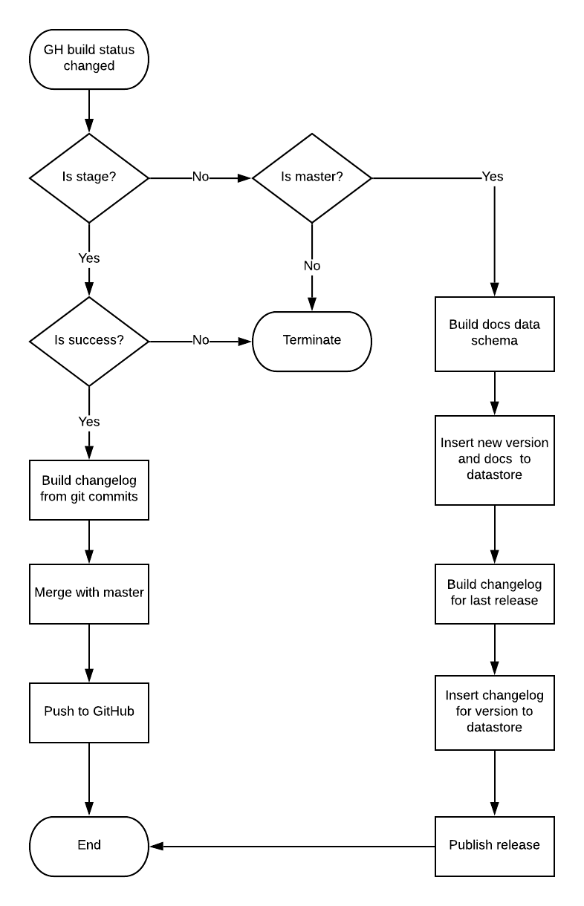

# API components publishing process

## Git branches

As in most projects the master branch represents production state of a component. This means the component published in NPM and on GitHub release page always reflect the state of the master branch. However, main branch in every component repository is `stage`. This is a transition layer between master and development. In most cases `stage` equals `master`. The `stage` branch is created to accept pull requests from contributors and the community. This branch initializes tests and the CI pipeline. After all checks finish with success the CI pipeline automatically builds the release and the documentation, and merges changes with master. The rule of thumb here is that commits to the `master` branch are never made manually.

## Sending a PR flow

## Running the CI flow

The CI pipeline has the following tasks:

* Update `changelog.md` file
* Merge `stage` with `master`
* Build docs for version and insert to the datastore
* Build changelog for version and insert to the datastore
* Publish release

The CI pipeline only accepts status change from `stage` and `master` branches. Depending on the state it performs merge or publishing operation.

The changelog and the docs are inserted into the datastore. This data are available via [API Components API](https://api.advancedrestclient.com/).

Note, the CI pipeline **do not bump version** for the release. It has to be done manually when commiting changes. Automatic bumping system was tested previously and did not meet our expectations. However, we are open to discuss changes in this are.

The CI pipeline application is an OSS project. The code can be found here: [https://github.com/advanced-rest-client/api-components-apps](https://github.com/advanced-rest-client/api-components-apps)

