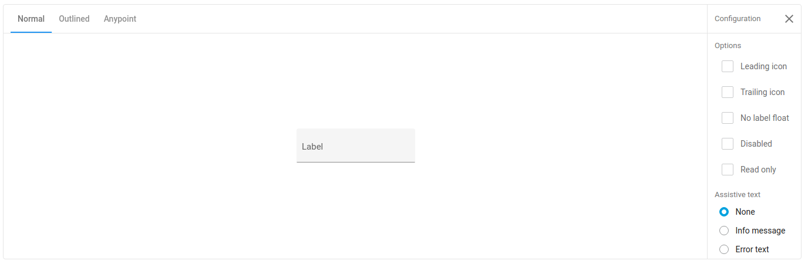

# arc-interactive-demo element

An element that renders demo content in predefined layout with a support for configuration options.



## Demo states

The tabs on the top-left represents a main states of a component. All API components by default implements Material Design principles \(filled and outlined style\) and Anypoint style. This should be handled by setting `states` property on the element. An example and most commonly used configuration is the following example.

```javascript
import { html } from 'lit-html';
import { ApiDemoPage } from '@advanced-rest-client/arc-demo-helper';

class ApiDemo extends ApiDemoPage {
  constructor() {
    super();
    this.componentName = 'api-my-component';
    this.renderViewControls = true;
    this.initObservableProperties([
      'compatibility', 'outlined'
    ]);
    this.demoStates = ['Filled', 'Outlined', 'Anypoint'];
    this.demoState = 0;
    this._demoStateHandler = this._demoStateHandler.bind(this);
  }
  
  _demoStateHandler(e) {
    const { value } = e.detail;
    this.demoState = value;
    this.outlined = value === 1;
    this.compatibility = value === 2;
  }

  contentTemplate() {
    const { amf, demoStates, darkThemeActive, compatibility, outlined, demoState } = this;
    return html`
    <arc-interactive-demo
      .states="${demoStates}"
      .selectedState="${demoState}"
      @state-chanegd="${this._demoStateHandler}"
      ?dark="${darkThemeActive}"
    >
      <api-my-component
        ?compatibility="${compatibility}"
        ?outlined="${outlined}"
        slot="content"
      ></api-my-component>
    </arc-interactive-demo>
    `;
  }
}

const instance = new ApiDemo();
instance.render();
```

The element that is being demoed should have `slot="content"` attribute set so the interactive demo element know it's placement.

## Demo options

Elements with slot="options" attribute are rendered in the options drawer. You can use any element that has `checked` property set on it to add automatic support for boolean values. The elements that should be rendered in the options panel should have `slot="options"` attribute set.

```markup
<arc-interactive-demo
  .states="${demoStates}"
  .selectedState="${demoState}"
  @state-chanegd="${this._demoStateHandler}"
  ?dark="${darkThemeActive}"
>
  <!-- Main content -->
  <my-component
    ?compatibility="${compatibility}"
    ?outlined="${outlined}"
    ?prop1="${prop1}"
    slot="content"
  ></my-component>

  <!-- Available options -->
  <label slot="options" id="mainOptionsLabel">Options</label>
  <!-- the "_toggleMainOption" handler is defined in the DemoPage class. -->
  <anypoint-checkbox
    aria-describedby="mainOptionsLabel"
    slot="options"
    name="prop1"
    @change="${this._toggleMainOption}">Boolean value</anypoint-checkbox>
</arc-interactive-demo>
```

When the checkbox is selected then the `_toggleMainOption()` function sets the current selection state on `prop1` property on the demo page. Then you can use this property in the template to control behavior of the element.


Don't forget to set an option property as an observable property. Otherwise the change won't trigger the render.


The demo page does not support other then boolean values. You need to provide own UI to support other values.

