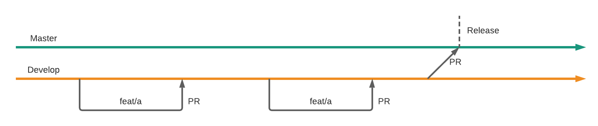

# API Component repository workflow


This is a new process started in Q1 2021.


Each repository has the `master` or `main` branch which reflects what is published on NPM or otherwise works in production. This branch has most of the CI automation of the release process. The other branch created for all repositories is `develop` which is the branch that is used to merge all feature branches into. When all features for the release are ready then the `defelop` branch is merged with the master via a PR. Once the PR is accepted and merged with the master / main branch then the automation script performs GitHub release and npm release taking care of building the change log and tagging a release.

The configuration script is places in the `.github/workflows/deployment.yml` of each repository. See an example in the [api-annotations-document](https://github.com/advanced-rest-client/api-annotation-document/blob/master/.github/workflows/deployment.yml) repository.

The diagram above illustrates the workflow with the git branches when developing a component. The workflow consists of few steps:

* Create a feature branch for the update \(or fix branch is this is a fix\) and put your stuff there
  * This step is obviously unnecessary when forking the repository
* When feature or a fix is ready create a PR from the branch to the develop branch.
  * This step is required for forked repositories as well. Do not merge your changes directly with the `master` / `main`.
* When all features for the release are ready create a PR from `develop` to `master` / `main` with bumped version number.
* Wait for the approval from the code owners.

